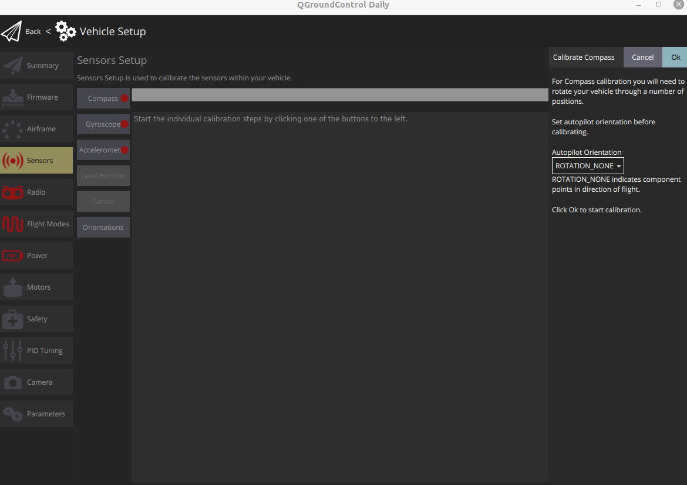
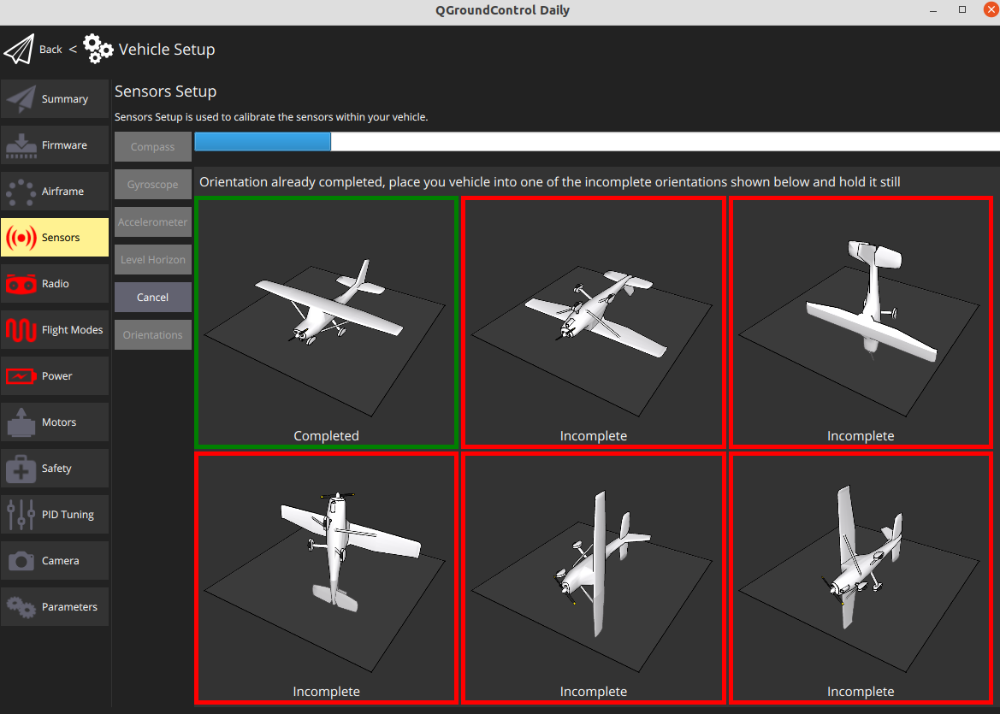

# Configuration

## Installing the PX4 Firmware


We recommend using the latest version of PX4 for a more stable flight. The current version The current is **v1.12.0-Beta 5**.



The official guide available at [https://docs.qgroundcontrol.com/master/en/SetupView/Firmware.html](https://docs.qgroundcontrol.com/master/en/SetupView/Firmware.html)



Do not unplug the PIxhawk during the installation process.


1. Open QGroundControl.
2. Click the icon at the top left.
3. Select **Vehicle Setup.**
4. Navigate the **Firmware** page.

1. Plug the Pixhawk into the computer's USB port. Once detected, QGroundControl will show a firmware selection pane on the right.
2. Choose **PX4 Flight Stack** __using the radio button.
3. Check the **Advanced Settings** _****_checkbox.
4. Choose **Beta Testing\(beta\)**.
5. Press **OK** at the top right.

The firmware will upload the Pixhawk, and you'll see the following printout and success message. The Pixhawk will reboot and then will automatically connect with QGroundControl.

## Airframe Selection

1. Go to the **Airframe** page.
2. Choose **Quadrotor x - DJI F450 w/ DJI ESCs.**

1. Hit the **Apply and Restart** button at the top right.

## Sensor Calibration

To perform the sensor calibration, go to the **Sensors** page.

### Compass

1. Click on **Compass.**
2. Choose a location away from large metal objects or magnetic fields.
3. Choose **ROTATION\_NONE** for the **Autopilot Orientation.**
4. Hit the **OK** to start the calibration**.** 

1. Then, follow the instructions. 

1. Once you've calibrated the compass in all the positions QGroundControl will display **Compass Calibration complete**.  
2. Click **Reboot Vehicle** in the right sidebar. Then you can proceed to the next sensor.

### Gyroscope

1. Click on **Gyroscope.**
2. Hit the **OK** to start the calibration

1. Then, follow the instructions.

### Accelerometer

1. Click on **Accelerometer.**
2. Hit the **OK** to start the calibration

1. Then, follow the instructions.

### Level Horizon

## Video Guide

To be edited

