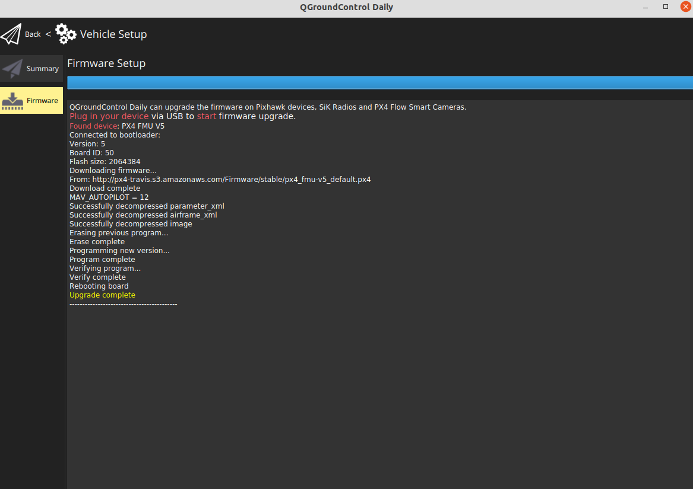

# Installing the PX4 Firmware

We recommend using the latest version of PX4 for a more stable flight. The current version is **v1.12.0-Beta 5**.


Do not unplug the PIxhawk during the installation process.


1. Open QGroundControl.
2. Click the icon at the top left.
3. Select **Vehicle Setup.**
4. Navigate the **Firmware** page.

1. Plug the Pixhawk into the computer's USB port. Once detected, QGroundControl will show a firmware selection pane on the right.
2. Choose **PX4 Flight Stack** __using the radio button.
3. Check the **Advanced Settings** _****_checkbox.
4. Choose **Beta Testing\(beta\)**.
5. Press **OK** at the top right.

The firmware will upload the Pixhawk, and you'll see the following printout and success message. The Pixhawk will reboot and then will automatically connect with QGroundControl.

## 

