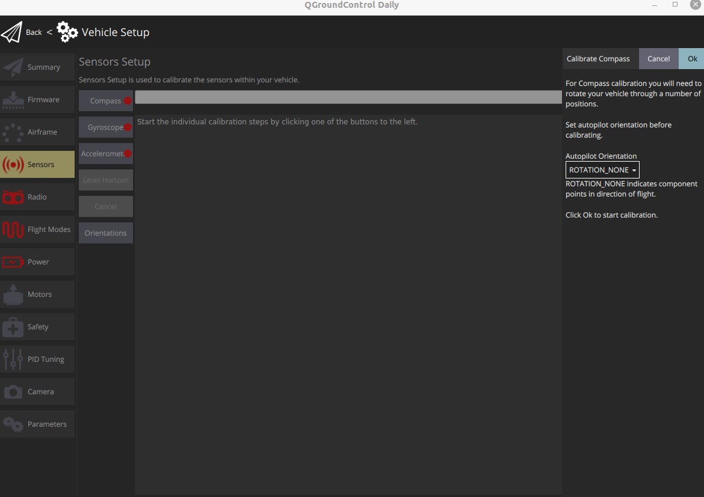
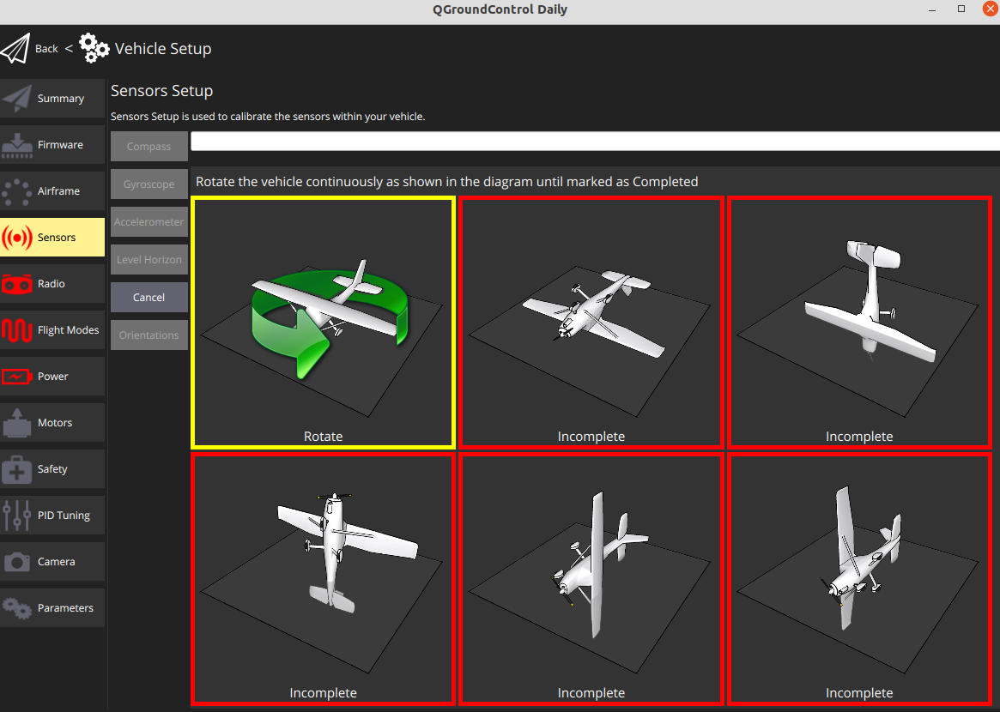
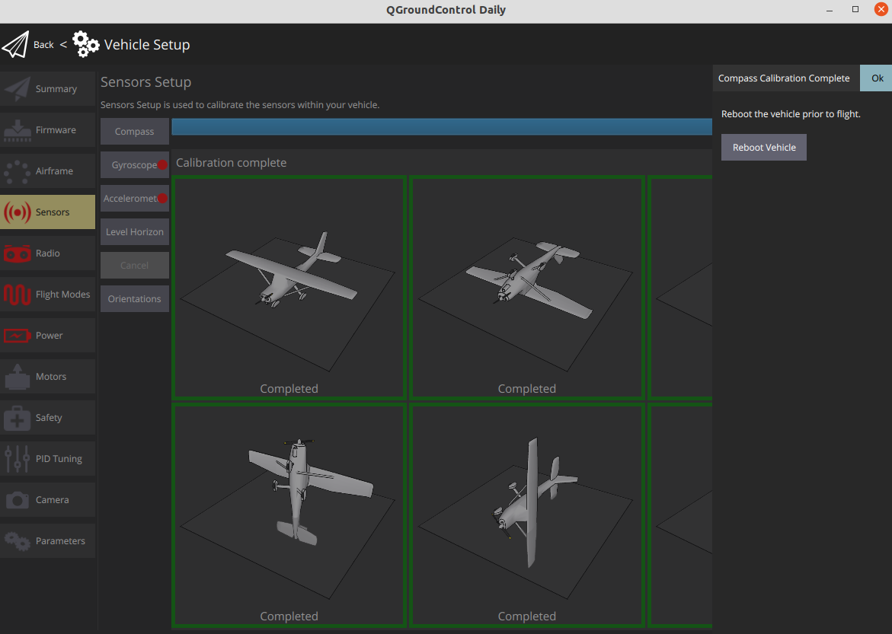
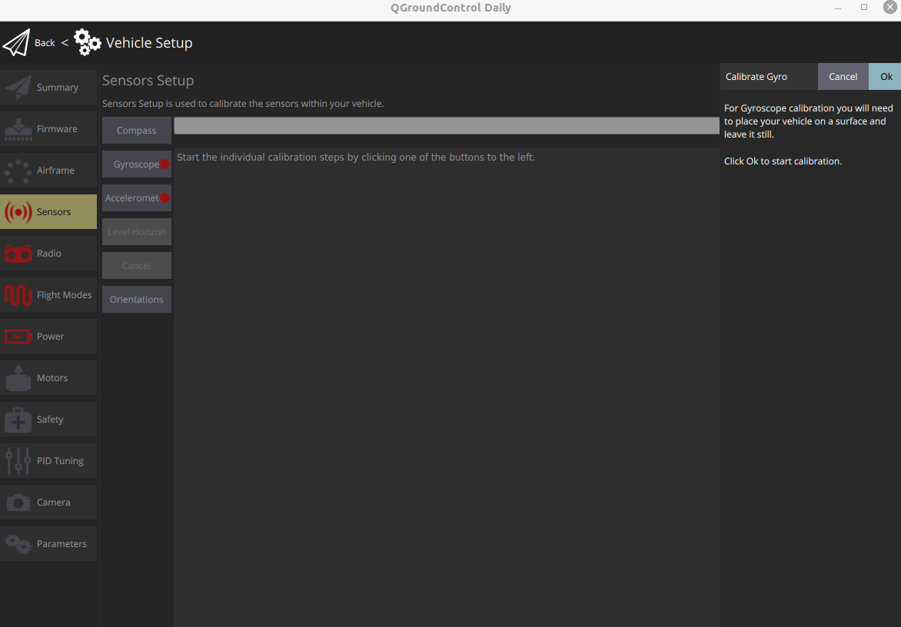
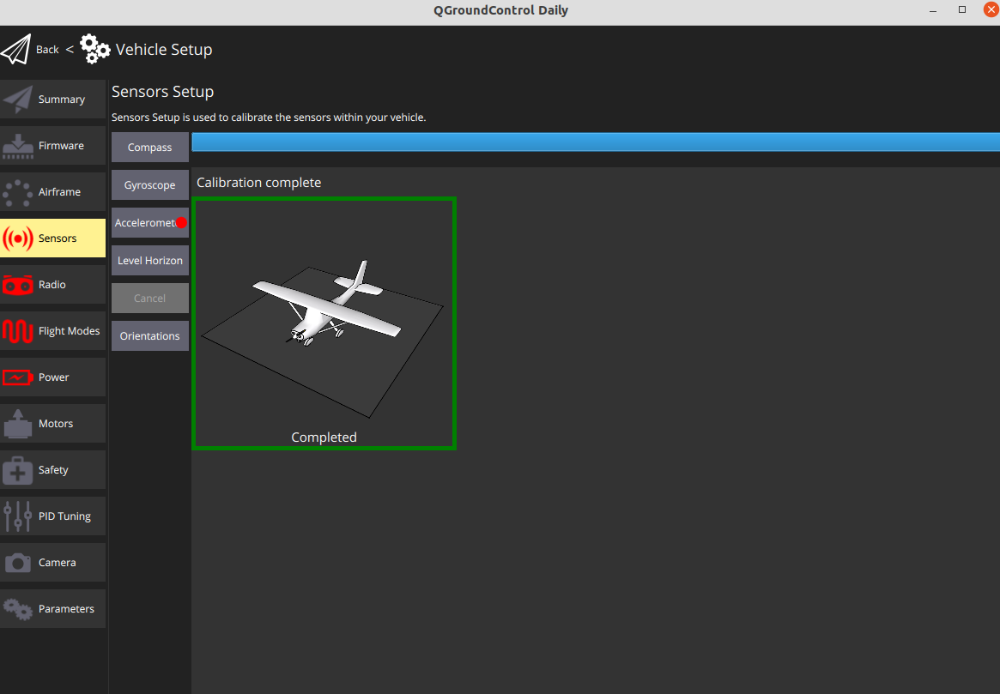
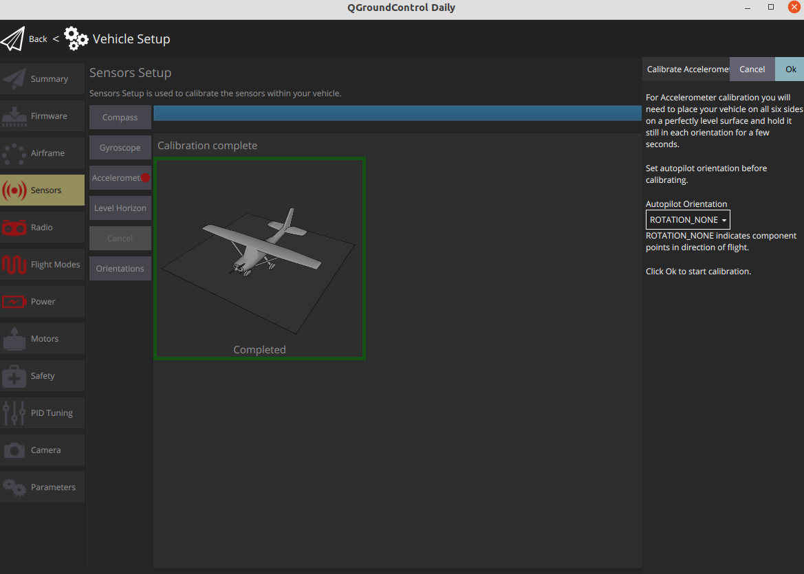
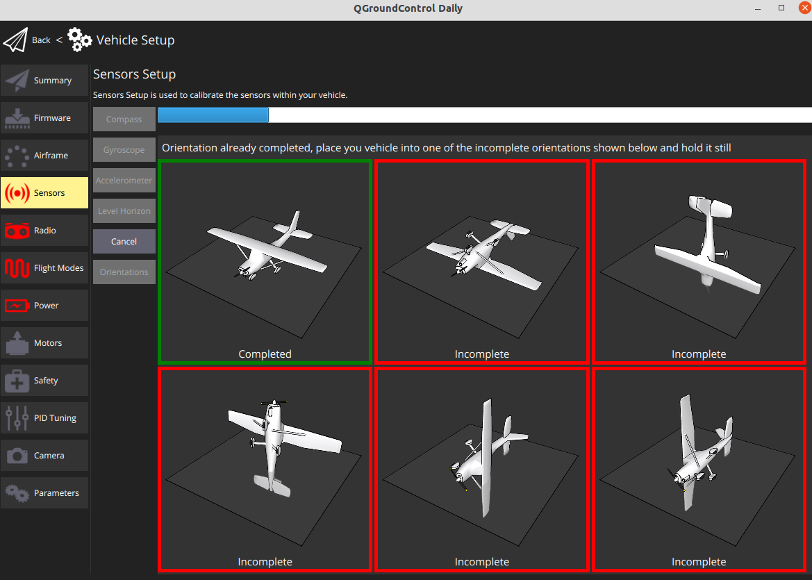

# Sensor Calibration

To perform the sensor calibration, go to the **Vehicle Setup** page and click the **Sensors** menu.

## Compass

Click on **Compass.**

1. Choose a location away from large metal objects or magnetic fields.
2. Choose **ROTATION\_NONE** for the **Autopilot Orientation.**
3. Hit the **OK** to start the calibration**.** 

1. Then, follow the instructions. 

1. Once you've calibrated the compass in all the positions QGroundControl will display **Compass Calibration complete**.  
2. Click **Reboot Vehicle** in the right sidebar. Then you can proceed to the next sensor.

## Gyroscope

1. Click on **Gyroscope.**
2. Hit the **OK** to start the calibration

1. Then, follow the instructions.

## Accelerometer

1. Click on **Accelerometer.**
2. Hit the **OK** to start the calibration

1. Then, follow the instructions.

## Level Horizon

## 

