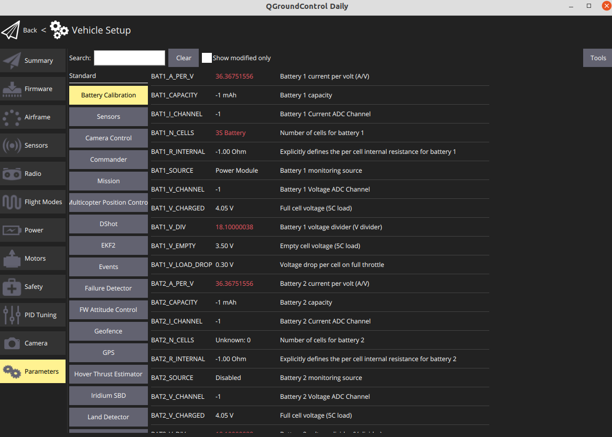
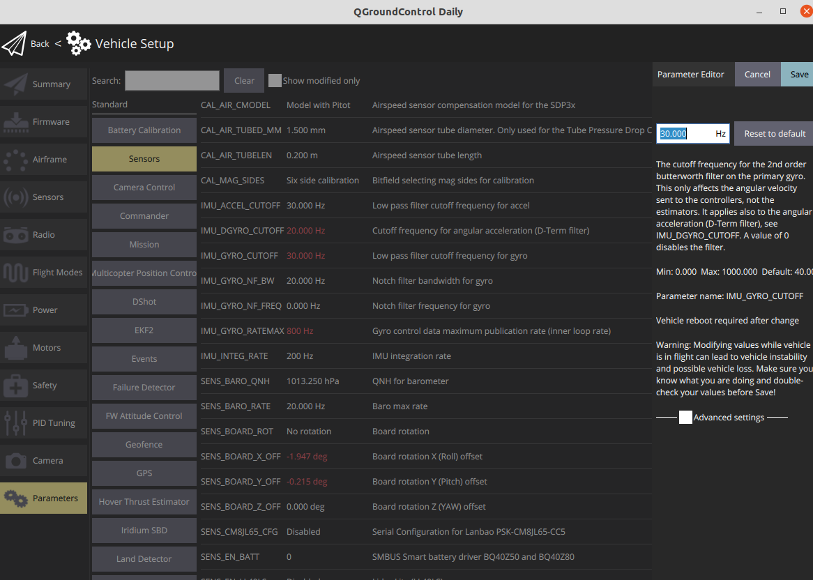

# PX4 Parameters

The drone behavior can be configured/tuned using PX4 parameters \(e.g., PID gains, calibration information, etc.\).  To change PX4 parameters, you can use the QGroundControl. 

1. Go to the **Vehicle Setup** page.
2. Click the **Parameters**

You can search for a parameter by entering a term in the **Search** field.

To change the value of a parameter click on the parameter row in a group or search list. This will open a side pane in which you can update the value.

This is **NOT** a complete set of PX4 parameters. These are non-default parameters and are meant to be loaded over the defaults.

