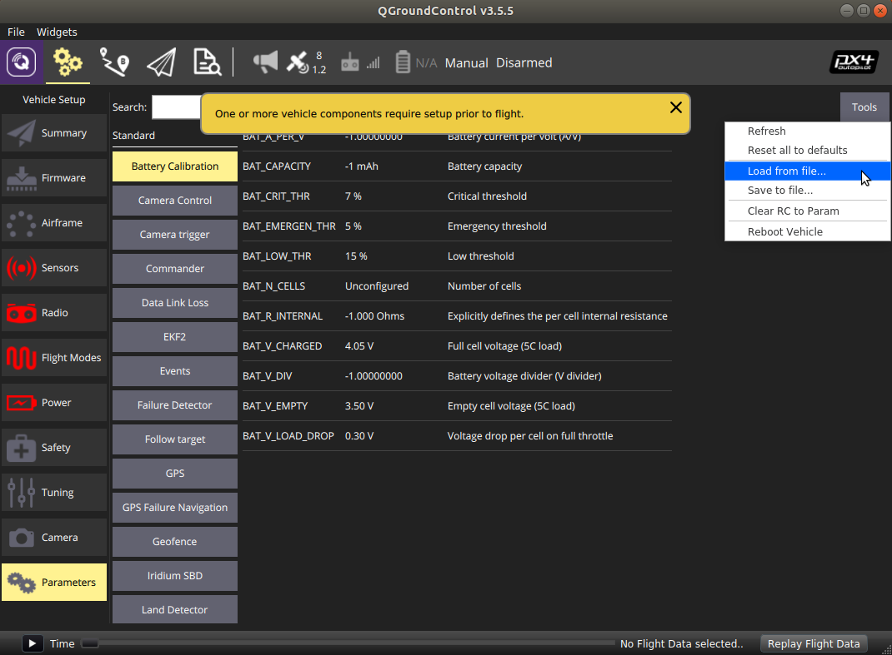

# PX4 Parameters

## Finding a Parameter

The drone behavior can be configured/tuned using PX4 parameters \(e.g., PID gains, calibration information, etc.\).  To change PX4 parameters, you can use the QGroundControl. 

1. Go to the **Vehicle Setup** page.
2. Click the **Parameters**

## Changing a Parameter

You can search for a parameter by entering a term in the **Search** field.

To change the value of a parameter, click on the parameter row in a group or search list. This will open a side pane in which you can update the value.


We suggest starting with our default set of PX4 parameters. However, you might need to tweak some of the values depending on your IRIDIA-drone. Currently, this project is tested on an IRIDIA-Drone platform with an F450 frame and Pixhawk 4 flight controller hardware. 



This is **NOT** a complete set of PX4 parameters. These are non-default parameters and are meant to be loaded over the defaults. The flight controller orientation is taken into consideration in this parameter file. We will update the parameters in the following repository accordingly. [https://drive.google.com/file/d/1J\_ePwPjfRhEhKosswTfJcKk4pAt7H9GJ/view?usp=sharing](https://drive.google.com/file/d/1J_ePwPjfRhEhKosswTfJcKk4pAt7H9GJ/view?usp=sharing)


##   Upload Parameters File 

The parameter file available from the above repository can be uploaded via QGroundControl.

1. Go to the **Vehicle Setup** page.
2. Click the **Parameters.**
3. Click **Tools** at the top right.
4. Select **Load from file.**


Many warnings will likely appear saying some parameters don’t exist yet. Close the warnings and reboot Pixhawk.



As you continue to work with PX4 on the Flight Core, you will want to refer to the official [PX4 parameters reference](https://docs.px4.io/master/en/advanced_config/parameter_reference.html). 


